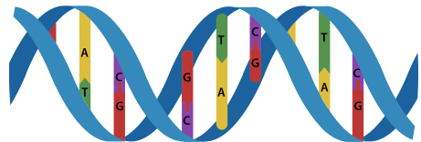
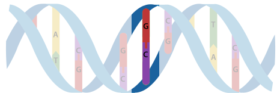

# 1000 Genomes Whole Genome PCA Example

<br/><br/>
<font style="font-size: 150%; font-weight: bold;">Upshot</font> <font style="font-size: 150%;">&nbsp;&nbsp;&nbsp;It's pretty easy to compute principal components of variants across thousands (or many more) of whole genomes.</font>
<br/><br/>

This example illustrates principal components (PCA) decomposition of genomic
variant data of 2,504 people from the 1000 genomes project[^1].  The example
looks for clusters of people with similar genmoic traits by projecting the very
high-dimensional genome-wide variant data into a three dimensional subspace.


## Genomic variants

Our genomes consist of billions of copies of four base molecules arranged in
pairs along our DNA. Sequences of these _base pairs_ define all our genomic
traits like eye color and whether we have freckles. Despite the immense length
of our genome, there is remarkably little variation from person to person.

Rather than always work with the full sequence of base pairs, we often
take advantage of the small variation from one person to the next to simply
store _differences_ between a genome and a so-called "reference" genome.
The differences are called _variants_ and might consist of, for example,
a single difference at one genomic position in a base pair, or an
insertion or deletion of a sequence of base pairs at specific point.

<hr/>
<table>
<tr><td align="center">


<tr><td align="center">
The figure shows an example single base pair variant, otherwise called
a SNP for _single nucleotide polymorphism_ [^2].
</table>
<hr/>

Storing variants instead of whole genomes results in a significant
space savings. For instance, there are only about 81 million differences
between the 2,504 people in the NIH 1000 Genomes project.

Identifying and specifying genomic variants is a very involved process, one
step in a complex and computationally intensive genomic sequencing
workflow. See
https://bioconductor.org/help/course-materials/2014/CSAMA2014/3_Wednesday/lectures/VariantCallingLecture.pdf
for many details.


## Variant analysis

The likelihood of certain diseases may be encoded in our genomic sequences.
The study of modified DNA from cells degraded by cancer is also an importantly
and heavily studied topic.

Scientists analyze genomic variants using a large and constantly expanding
variety of techniques. This note analyzes variant data from the NIH 1000
Genomes Project using a classification method called principal components
analysis (PCA). The method is representative of many unsupervised machine
learning techniques and good at projecting high-dimensional data down into a
lower dimensional subspace to help identify groups of points (people) with lots
in common.

The technique used here is discussed in a Google Genomics video here
https://www.youtube.com/watch?v=ExNxi_X4qug&feature=youtu.be&t=6m21s although
we suspect based on the presented output that only a subset of the genome was
used in their analysis, perhaps one or two chromosomes.

Similar techniques are used in cancer genomics to classify tumor cells, in
plant and animal breeding genomics, and in many more areas of genomic research.

We present two versions of a whole-genome variant PCA:

1. A horizontally-scalable version suitable for clusters of machines with relatively limited RAM
2. A fully in-memory SMP version

Both approaches use R.


## 1000 Genomes Analysis

We arranged variant data from the 1000 Genomes Project into a very sparse matrix
of 2,504 rows (people) by 81,271,844 columns (genomic variants), but with only
about 9.8 billion nonzero-elements, that is only a little over 2% fill-in.  In
other words not every person exhibits all variants.

Our objective is to project these 81,271,844 dimensional data down to just
three dimensions using principal components analysis (PCA) and visualize the
resulting clusters.

We take an approach breaks the problem up into sequences of smaller problems.
Solving the problem by breaking it up into manageable pieces has the advantage
of promoting scalability. Those pieces can be run on other CPU cores or even
networked computers relatively easily.  Importantly, our approach can handle
large numbers of whole genomes.


## Results

The 1000 Genomes data contain over 81 million dimensions. We use PCA to project
those data into a three-dimensional space, which despite the substantial data
reduction still contains a large amount of the information in the original
data.

Of course we can _see_ data in three dimensions, so lets look at the result!
```{r, eval=TRUE, echo=FALSE}
suppressMessages(
{
  library(threejs)
})
load("chunked.rdata")
load("ped.rdata") # superpopulations
N = length(levels(ped$Superpopulation))
scatterplot3js(L$v, size=0.5, grid=FALSE,  col=rainbow(N)[ped$Superpopulation])
```
The data exhibit obvious groups, and those groups in this case correspond to race and ethnicity.
The above plot colors the data by "Superpopulation", a designation of each
subject's reported racial heritage. The superpopulations correspond very well
to the latent clusters "discovered" in the data by PCA. Notice the level
of detail in each cluster, some of which display distinct sub-clusters.
Compare with the next illustration computed using only a portion of the
variants across the whole genome (similar to the plot shown in the Google
Genomics example above).
```{r,eval=TRUE,echo=FALSE,}
library(DT)
datatable(data.frame(Color=c("red", "yellow", "green", "blue", "purple"),
Superpopulation=c("AFR", "AMR", "EAS", "EUR", "SAS"),
Description=c("African", "Admixed American", "East Asian", "European", "South Asian")), options = list(dom='t', columnDefs=list(list(targets=0:2, class="dt-right"))), rownames=FALSE)
```

Compare these clusters with those obtained from one chromosome (20) here
http://bwlewis.github.io/1000_genomes_examples/PCA.html:
```{r,eval=TRUE,echo=FALSE,}
load("chr20.rdata")
scatterplot3js(p$u, size=0.5, grid=FALSE,  col=rainbow(N)[ped$Superpopulation])
```
Notice that there is much finer detail in the whole genome plot. Zooming in on
some of the clusters shows distinct subclusters.


## References

[^1]: http://www.1000genomes.org/
[^2]: http://biosocialmethods.isr.umich.edu/epigenetics-tutorial/epigenetics-tutorial-genome-structure/
