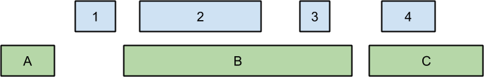

# 1000 Genomes Overlap Join Example

Finding overlapping regions between two sets of coordinate values is
a common problem in computational genomics and other disciplines.
At least two R packages can very rapidly perform this computation: the IRanges
package by Pages, Aboyoun and Lawrence in the bioconductor[^1]
and the widely popular data.table package by Dowle, Short, Lianoglou, Srinivasan, and others[^2].

[^1]: Gentleman R.C., Carey V.J., Bates D.M., Bolstad B., Dettling M., Dudoit S., Ellis B., Gautier L., Ge Y., Gentry J., Hornik K., Hothorn T., Huber W., Iacus S., Irizarry R., Leisch F., Li C., Maechler M., Rossini A.J., Sawitzki  ., Smith C., Smyth G., Tierney L., Yang J.Y. and Zhang J. (2004) Bioconductor: open software development for computational biology and bioinformatics. Genome Biol. 5(10): R80.

[^2]: https://github.com/Rdatatable/data.table/wiki


## The Overlap Join

The _overlap join_ finds overlapping regions between two tables of coordinates.
The following figure, adapted from Alex Poliakov at Paradigm4, illustrates a
simple example. The right to left extent of the blue and green boxes depicts
two sets of ranges, respectively.



The overlap join operation finds ranges with overlapping extents, for example
the green box labeled "B" overlaps with the blue boxes "2" and "3", and the
green box labeled "C" overlaps with the blue box labeled "4." In practice,
overlap joins may be performed on tables with millions of ranges.

## Summary

This note compares the performance of R with the community edition of
Vertica[^3] for a representative genomic data example on modest computer
hardware. R is generally faster and better-suited to solving problems like the one described
here than other systems.

[^3]: http://my.vertica.com


## Computed Example

The example presented below finds overlaps
between genomic variant coordinates from the 1000 genomes
project[^4], and a list of human gene coordinates from
https://www.pharmgkb.org/ [^5]. The example proceeds as follows:

[^4]: An integrated map of genetic variation from 1,092 human genomes, McVean et Al, Nature 491, 56-65 (01 November 2012) doi:10.1038/nature11632.

[^5]: M. Whirl-Carrillo, E.M. McDonagh, J. M. Hebert, L. Gong, K. Sangkuhl, C.F. Thorn, R.B. Altman and T.E. Klein. "Pharmacogenomics Knowledge for Personalized Medicine" Clinical Pharmacology & Therapeutics (2012) 92(4): 414-417.

1. Find variant and gene overlaps
2. Count the number of variants that overlap each gene by gene symbol
3. Order the genes by number of variant overlaps and display the top 50

The R packages include functions that combine steps 1 and 2 into a single step,
gaining some efficiency along the way. I'm not using those more efficient
functions in this example.

In order to fairly represent typical performance, the R examples report both
timings for loading stored data from data files and for just the overlap join
computation part (file load dominates).

You can copy and paste the examples and run them on your own hardware. The
timings presented here ran on a modest PC with a single AMD A10-7850K 3.7 GHz
quad-core CPU with 16 GB DDR3 RAM and fast 960 GB OCZ Revodrive3X2 PCI express
SSD storage. Software versions used include Ubuntu GNU/Linux 14.04, R version
3.1.2, IRanges version 2.01,
data.table 1.9.5 installed from GitHub and compiled
with -O3 optimization, Vertica "community edition" version 7.1.1-0.  I ran all
the tests at least three times in a row to get a feel for performance variation
and disk cache effects, etc.

### Download the data files

```
wget ftp://ftp-trace.ncbi.nih.gov/1000genomes/ftp/release/20130502/ALL.chr7.phase3_shapeit2_mvncall_integrated_v5a.20130502.genotypes.vcf.gz
wget ftp://ftp-trace.ncbi.nih.gov/1000genomes/ftp/release/20130502/ALL.chr8.phase3_shapeit2_mvncall_integrated_v5a.20130502.genotypes.vcf.gz 

wget -O genes.zip "https://www.pharmgkb.org/download.do?objId=genes.zip"
unzip genes.zip
```


### R

I break the R examples down into three parts: parsing the data,
computing overlaps with data.table, and computing overlaps with IRanges.

The following code parses the input variant files into R data.frames
with position, reference allele, and alternate allele columns. It then
stores the data.frames as binary R data files for later processing.

I take this approach rather than immediately processing the parsed input
files for a few reasons. Most importantly, I think a work flow like this
is better representative of a typical research setting. (It is likely that,
once parsed, the variant data will be saved for many potential downstream
analyses.) Also, a work flow broken into easily separated component parts
promotes parallel and distributed computation later on for larger-scale
problems. Finally, it provides a fair comparison with Vertica in
this case.

```{r, eval=FALSE}
library(parallel)

f = function(file)
{
  t2 = proc.time()
  cmd = sprintf("zcat %s | sed '/^#/d;/IMPRECISE/d' |  cut -f 2,4,5",file)
  name = gsub(".phase.*","",file)
  print(name)
  x = read.table(pipe(cmd), stringsAsFactors=FALSE)
  names(x) = c("start","ref","alt")

  # Process extra comma-separated alleles (would be much easier if these were
  # on separate rows!)
  idx = grepl(",",x$alt)
  s = strsplit(x[idx, "alt"],",")
  # replace these rows with 1st alternate allele
  x[idx,"alt"] = vapply(s, function(z) z[1], "")
  # Add new rows corresponding to other listed alternates
  ref = x[idx,1:2]
  N   = vapply(s, length, 1) # numbers of alternates by row
  alt = lapply(2:max(N), function(i)
    {
      j = which(N==i)
      cbind(ref[j, ], alt=vapply(s[j], function(z)z[i], ""))
    })
  x = rbind(x, Reduce(rbind, alt))
  # Finally order the data.frame for faster file I/O
  x = x[order(x$start),]

  save(x, file=sprintf("%s.RData",name))
  return(proc.time()-t2)
}

files=dir(pattern="*.vcf.gz")  # All chromosomes
#files=dir(pattern=".*chr[7,8].*.vcf.gz")  # just 7,8
t1 = proc.time()
mclapply(files, f)
print(proc.time()-t1)
```

This step takes about 260 seconds on my test PC (to parse and save
9,362,139 variants on both chromosomes 7 and 8).

The parsing program is complicated by the doubly-delimited data file format. In
particular more than one alternate allele may be listed per line separated by
commas (the remainder of the file is tab separated). R handles the
extra format complexity with relative ease and efficiency. Parsing multiple
alternate alleles adds only about 12 lines to the R program and runs very fast.
I think that languages like R should be used most of the time partly because of
this superb flexibility and ease of handling more complicated work flows.

We use some shell utilities here to help uncompress and process the TSV files.
R's `pipe` connection object makes it easy to operate on pipelines of shell
commands conveniently from R.  (The data.table package includes similar
functionality but, somewhat unfortunately, with a different syntax).
Note the trick of
ordering the first data.frame column, which interestingly
leads to a significant
performance increase in file I/O for this example.

Because the above processing pipeline includes several stages (zcat, sed, cut,
read.table), there is already a fair amount of parallel computation going on.
The script additionally uses the explicitly parallel `mclapply` function which
may lead to some over-committing of CPU resources, but still generally improves
performance.

Note that the script omits imprecisely specified variants, further described
here: http://goo.gl/PFsIsP. Handling imprecise variants would add a lot of
complexity to this simple example.

The genes.tsv file is so small and fast to parse by comparison that I simply
parse it directly from the TSV file into a data.frame named "genes" (which
takes only seconds) and don't bother to save it. The following script loads
the 1,989 listed gene ranges corresponding to 
chromosomes 7 and 8 into a data.frame.
```{r, eval=FALSE}
cmd = "cat genes.tsv | cut -f 6,13- | grep 'chr[7,8]' | sed /-0000/d | sed -e 's/chr7/7/;s/chr8/8/'"
p = pipe( cmd, open="r")
genes = read.table(p, stringsAsFactors=FALSE, header=FALSE, sep="\t")
close(p)
names(genes) = c("gene","chromosome","start","end")
genes = genes[genes$start > 0 & genes$end > 0, ]
```

The output of the above steps consists of two RData files corresponding to
chromosome 7 and 8 variant data, respectively, and an in-memory genes
data.frame.

### R data.table

The popular R data.table package includes a fast overlap join function
called `foverlaps`. You can install the data.table package from CRAN with:
```{r, eval=FALSE}
install.packages("data.table")
```

The following code reads a saved R data file, then uses the `foverlaps`
function to compute the overlap join and then ranks genes by the by the number
of overlapping variants per gene and retains the top 50. The code runs in
parallel using the `mclapply` function.
```{r, eval=FALSE}
library(data.table)
library(parallel)

# The overlap function takes a chromosome number as input, loads
# the corresponding chromosome variant file, finds overlaps with the
# genes data.frame, and returns a list of gene symbols corresponding to
# each overlapping range.
overlap = function(chromosome)
{
  file = sprintf("ALL.chr%s.RData", chromosome)
  load(file)
  x$end = x$start + nchar(x$ref)

  g = genes[genes$chromosome==chromosome, c(1,3,4)]
  setDT(g)
  setkey(g, start, end)
  setDT(x)

  # Display timing for just the overlap computation part too
  t1 = proc.time()
  ans = foverlaps(x,g,which=TRUE,nomatch=0)
  print(proc.time()-t1)
  g$gene[ans$yid]
}

# Compute the overlaps in parallel with mclapply for chromosomes 7 and 8
t1 = proc.time()
ans = unlist(mclapply(7:8, overlap))

# Top 50 genes with most overlapping variants
ans = head(sort(table(ans), decreasing=TRUE), n=50)
print(proc.time()-t1)
```
The ouput of this step looks like:
```{r,eval=FALSE}
head(ans,n=10)
#  CSMD1 CNTNAP2    SGCZ    SDK1   MAGI2  PTPRN2   CSMD3    NRG1   AUTS2   SNTG1 
# 148202   76416   52725   45673   44388   42186   34721   33353   31673   29758
```
The example script takes about 9 seconds on my test PC to identify the 1,987
overlapping variants. The overlap join part
runs in only about 2 seconds
per chromosome (run in parallel here), so most of the
time is spent retrieving the binary R variant data.frames from file storage.

### R IRanges

We can compute the top 50 genes with counts of overlapping variants similarly
in R using the IRanges package from the bioconductor.

You can install the IRanges package with:
```{r, eval=FALSE}
source("http://bioconductor.org/biocLite.R")
biocLite("IRanges")
```

The example program is almost identical to the data.table version above:
```{r, eval=FALSE}
library(IRanges)
library(parallel)

overlap = function(chromosome)
{
  file = sprintf("ALL.chr%s.RData", chromosome)
  load(file)
  ir1 = IRanges(start=x$start, end=x$start + nchar(x$ref))

  g = genes[genes$chromosome==chromosome, c(1,3,4)]
  ir2 = IRanges(start=g$start, end=g$end)

  t1 = proc.time()
  ans = findOverlaps(ir1, ir2)
  print(proc.time()-t1)
  data.frame(gene=g$gene, count=countRnodeHits(ans))
}

# Compute the overlaps in parallel with mclapply for chromosomes 7 and 8
t1 = proc.time()
ans = Reduce(rbind, mclapply(7:8, overlap, mc.cores=2L))
ans = ans[order(ans$count, decreasing=TRUE), ]

# Top 50 genes with most overlapping variants
head(ans, n=50)
print(proc.time()-t1)

head(ans, n=10)
#  CSMD1 CNTNAP2    SGCZ    SDK1   MAGI2  PTPRN2   CSMD3    NRG1   AUTS2   SNTG1 
# 148202   76416   52725   45673   44388   42186   34721   33353   31673   29758 
```
The IRanges example runs in about 8 seconds on my test PC. Just the overlap
join portion runs in about 0.8 to 1 seconds per chromosome, about twice as fast
as the `foverlaps` function available in the data.table package.

### Vertica

We use a few shell commands to decompress the data files and pick out columns
5,12,13 from the genes file (gene symbol, start and end), and filter it to
include only genes on chromosome 7 and 8.

I couldn't figure out an easy way to process the doubly-delimited variant data
format either within Vertica or from shell scripts, so I use R to parse the
variant data (see above) and save it to a tab separated file that Vertica can
read. The lack of easy data munging capability is a serious drawback in my
opinion of most database systems.
```
cat genes.tsv | cut -f 5,12- | grep 'chr[7,8]' | sed /-0000/d | sed -e 's/chr7/7/;s/chr8/8/' > genes_parsed.tsv
R --slave -e "load('ALL.chr7.RData');x[,'chromosome']=7;write.table(x,file='variants.tsv',col.names=FALSE, row.names=FALSE); load('ALL.chr8.RData');x[,'chromosome']=8;write.table(x,file='variants.tsv',col.names=FALSE, row.names=FALSE,append=TRUE);"
```
Once processed we can create tables for genes and variants in Vertica and load the processed TSV data into them with:
```
vsql <<EOF
drop table if exists genes;
drop table if exists variants;

create table genes(
  gene_symbol varchar(32) primary key,
  chromosome integer,
  start_position integer,
  end_position integer
);

create table variants(
  chromosome integer not null,
  start_position integer not null,
  reference varchar(255) not null,
  alternates varchar(255) not null,
  primary key (chromosome, start_position, reference, alternates)
);

copy genes from '/$(pwd)/genes_parsed.tsv' delimiter '  ';
copy variants from '/$(pwd)/variants.tsv' delimiter '   ';
EOF
```
Counting the time it took R to process the variant data and produce a TSV file
for Vertica, the load process took about 303 seconds on my test PC.

Once loaded, we can compute the overlap join and gene ranking in Vertica with
the query:
```
vsql <<EOF
drop table if exists temp;

create table temp as
select G.gene_symbol, count(V.reference) as "variants"
 from genes G join variants V
   on G.chromosome = V.chromosome
   and (G.start_position <= (V.start_position + length(reference) - 1) and G.end_position >= V.start_position)
   group by 1 order by 2 desc limit 50;

select * from temp order by 2 desc;
EOF
```
The query produces an output that looks like (just the top part):
```
 CSMD1       |   148202
 CNTNAP2     |    76416
 SGCZ        |    52725
 SDK1        |    45673
 MAGI2       |    44388
 PTPRN2      |    42186
 CSMD3       |    34721
 NRG1        |    33353
 AUTS2       |    31673
 SNTG1       |    29758
```
This query takes about 28 seconds to run on my test PC.
I tried to improve query performance by running
```
echo "select analyze_statistics('');" | vsql
```
which took a few seconds to compute, but the query performance was unchanged.


## Discussion

The overlapping ranges produced by the `findOverlaps` and `foverlaps` functions
agree. Although the top 10 results displayed above agree for the Vertica
query, 65 of the 1,987 ranges had different counts. I'm still looking in to
possible causes of this discrepancy.
